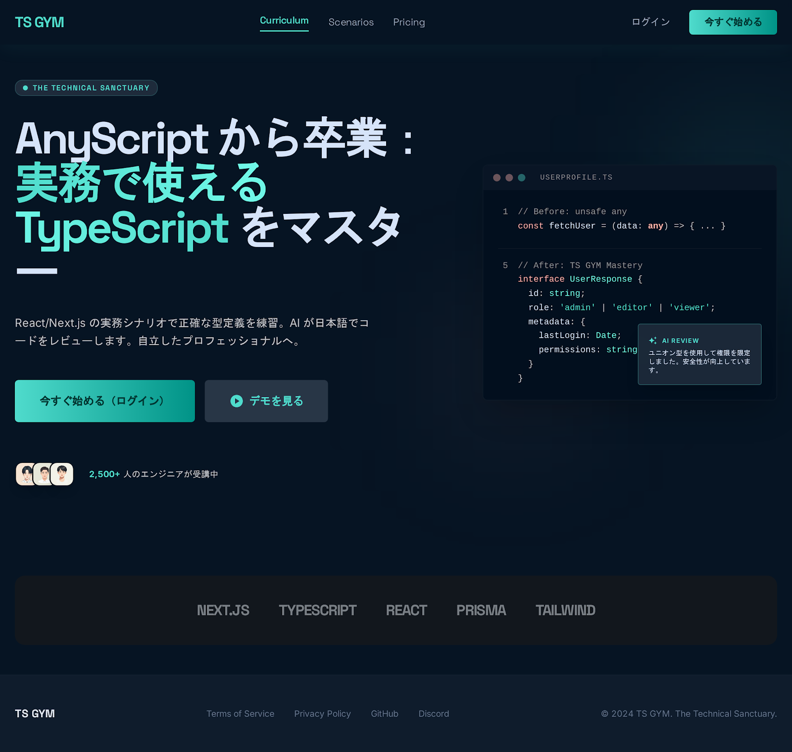
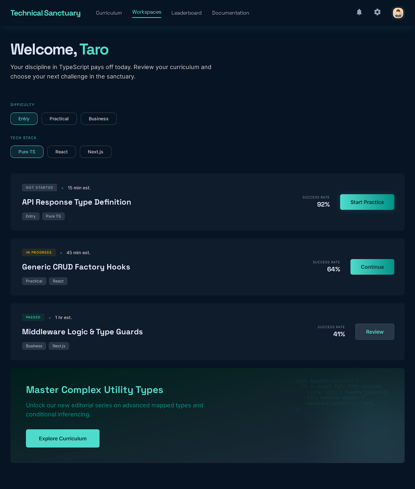
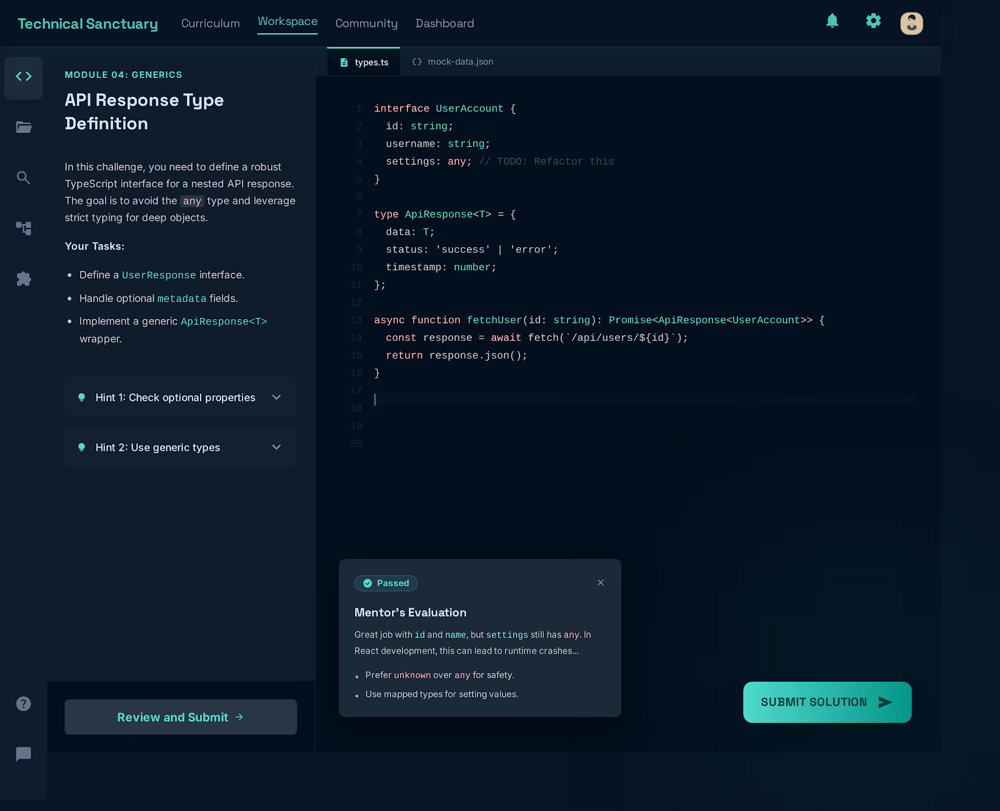

# TS GYM 🏋️

> AnyScript から卒業：実務で使える TypeScript をマスター

React/Next.js の実務シナリオで正確な型定義を練習。AI が日本語でコードをレビューします。

## スクリーンショット

### トップページ



### ダッシュボード



### コードサンドボックス



## 技術スタック

- **Framework**: Next.js 15 (App Router)
- **Language**: TypeScript
- **Styling**: Tailwind CSS
- **UI**: shadcn/ui
- **Editor**: Monaco Editor
- **AI Review**: Groq API (llama-3.3-70b)

## 主な機能

- Monaco Editor を使ったインタラクティブなコードサンドボックス
- AI による日本語コードレビュー（問題点・改善ヒント・一言コメント）
- TypeScript のリアルタイムシンタックスハイライト

## ローカル環境での起動

```bash
pnpm install
pnpm dev
```

`.env.local` に以下を設定してください：

```
GROQ_API_KEY=your_api_key_here
```
